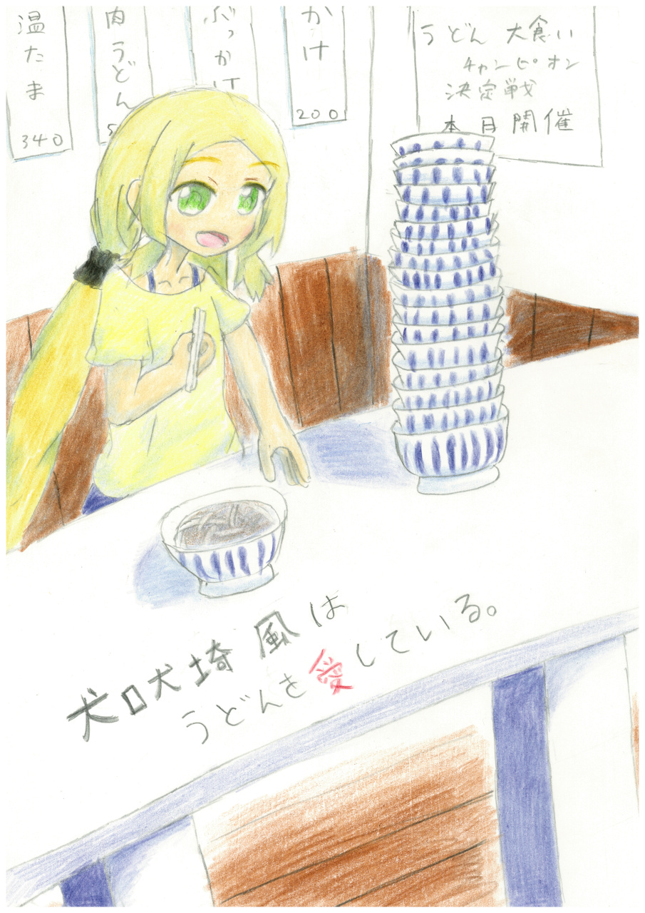

# 犬吠埼風はうどんを愛している

## エディション

 - [PDF](./犬吠埼風は、うどんを愛している。.pdf)
 - [一太郎](./ichitaro)

## Markdown版

「ちょっと！うどん屋なんてどこにもないじゃない！最高に美味しいうどん屋
があるんじゃなかったの！？」

「せっかく東郷さんにインターネットで調べてもらったのに…最近閉店したの
かなぁ？それにしては…ずいぶん古い廃墟だけど…崩れそうで怖いよ…姉ちゃ
ん、早く帰ろう？」

「あぁ…う…うどん…うどん…」

「お姉ちゃん！？」

　犬吠埼風は、うどんを燃料として生きている。

　で、あるからして。

　うどんが無ければ、動作を停止してしまう。

＊＊＊

　バーテックスの魔の手は一旦止み、友奈たちが勇者の御役目から開放され、
日常へ戻ってしばらく経ったころ…（つまり、一期終了～二期開始ぐらいのこ
ろ…）。

「そういえば最近ね、うどん屋の新規開拓がアツいのよ」

　人形劇の人形のメンテナンスをしながら、風はなんとなく他愛もない会話を
はじめた。

「風先輩、『かめや』の肉うどんが大好きだったのに…。ひょっとして、飽き
ちゃったんですか？」

「いいえ、友奈。『かめや』の肉うどんは間違いなく最高よ。でも、アタシの
ような女子力の高い真のうどん好きは、定番で安住しないのよ。常に新しいう
どんとの出会いを模索する。それこそが女子力王ってわけ」

「なによそれ、わけわからんわ。」

　夏凜のツッコミが間髪入れずに入る。

「うどんならいつも食べてるじゃない。あんまりうどんばっかり食べてると、
糖尿病一直線よ」

　夏凜は煮干しを片手に、小道具を念入りに掃除している。

「煮干しばっかり食べてるあんたに言われたくはないわ！」

「煮干しは体に良いし、サプリも最近さらにマシマシだから健康的な食生活そ
のものよ。風もどう？」

　夏凜はどこからともかくサプリの錠剤を出した。…あの制服のどこに大量の
サプリを持っているのは、誰にもわからない。

「夏凜ちゃん、食事というのは一汁三菜が基本よ。サプリに頼らず日本人らし
く毎日和食を」

「まぁまぁ東郷さん、その話はまた今度…」

　友奈がなんとなくたしなめる。

「それに、散歩した後にはお腹が空くものよ？」

　風は、大げさにお腹に手をあて、空腹で倒れる人をその体で表現していた。
たぶん。

「風先輩、散歩が趣味なんでしたっけ」

　犬吠埼風は、うどん屋の新規開拓にひそかに燃えていた。普段の「かめや」
も悪くない。むしろ「かめや」の肉うどんは、間違いなく讃州で５本の指に入
る素晴らしさだ。しかし、風はうどんという食べ物ーないし存在ーそのものが
好きである。愛していると言ってもよい。新しいうどんとの出会いを、常に渇
望している。そして、風は散歩も趣味だ。散歩と「うどん欲（？）」の２つを
同時に満たせるうどん屋巡りは、風にとって至福の時間であった。

　それに、「かめや」で毎回勇者部の打ち上げをしていたのには他の理由もあ
った。かめやは駐車場が広く、車で移動する足の不自由な東郷に余計な負担を
掛けない。たしかに重要な事情ではあるが、うどんそのものとは関係がない。
しかし、それは過去の話である。大赦の御役目から解放されて、東郷は歩ける
ようになった。それなら、今後は「かめや」だけではなく、勇者部の依頼で行
った先々のうどん屋で打ち上げをするのも悪くないだろう。

　そんなわけで、風は新しい散歩コースの開拓と新しいうどん屋の食べ歩きに
勤しんでいた。

「それに～？みんなが依頼で疲れてるときにサラッと美味しいうどん屋を紹介
できればアタシの部長としての威厳がうなぎのぼりじゃない？」

「お姉ちゃん、相変わらず本音と建前がひっくり返ってるよ…」

「どっちも本音よ」

「姉妹同士で心の読みあいすんな！」

「でもうどん屋さんの新規開拓は楽しそうですね！わたしもしてみようかな〜
風先輩、一緒に行っても良いですか？」

「ぜひお願いしたいわ！東郷にインターネットで調べてもらって行ってるんだ
けど、もう閉店してることも多いのよ」

「それは失礼しました…」

「ち、違うのよ東郷。東郷の提供してくれる情報にはいつも助かってるわ。そ
うじゃなくてね、東郷の力をもって調べても、それだけうどん屋が閉まってる
ってことは、そのぶん、きっとインターネットには載っていないまだ見ぬ新し
いうどん屋がアタシたちを待ってるってことだと思うのよね」

「なるほど…。たしかに、インターネットの口コミは数年しないと蓄積されま
せんが、その間に閉店されてしまっていているものも多そうですね」

「でしょ。インターネットに頼るのもいいけど、たぶんそれだけじゃ最強のう
どん屋には巡り会えないと思うのよ」

「最強のうどん屋って…」

「きっと最強のにぼしで出汁取ってるわよ」

「だから最強のにぼしって何よ！」

「いいですね！最強のうどん屋さん！結城友奈、最強のうどん屋さんに会いに
行きたいです！」

「友奈ちゃんがそういうなら私も…」

「…まぁ…たまには…軽めの運動メニューを組むのも大事かもしれないわね
…」

　それぞれの思惑は異なるものの、風と共にうどん屋の新規開拓をするという
一点においては全員で見解の一致を見たようだった。

「それじゃ、さっそく次の土曜日に出陣よ」

「了解であります！…って…土曜日…明日ですか！？」

「そんなに急となると…わたしも空いているかしら…？」

　東郷はスマートフォンで予定を調べる。

「…なるほど。友奈ちゃん、次の土曜日はたまたま依頼がなくて全員予定がつ
くのよ。…全員で、となると、次に可能な日程はだいぶ先になってしまいます
ね、風先輩」

「そうなのよ。神樹さまも善はいそげー！って言ってるのよ。うどん屋行くわ
ようどん屋」

　風はうどんに目がない。いや、目をむいた先にうどんしかない、というべき
か…。

「そういうもんかしらね…まぁいいけど…」

　東郷は、にぼしをかじる夏凜を眺めながら、古くからの友人のことについて
考えていた。サンチョが相棒の、乃木園子である。

（いくらなんでも…直近の忙しさに比して、この日だけまるで無理に空白を拵
えたかのように前任とも何も予定がない…こんな事態…自然に発生しうるかし
ら？まさか、そのっちが裏で…？まさか、そんなことあるはず…）

＊＊＊

　翌日。

　とくにどこで待ち合わせをするかについては事前に決めてはいなかった。う
どん屋めぐりは、あくまで風の趣味に皆が付き合っているだけだから、勇者部
の活動とは関係がない。しかし、それでも、全員が自然と勇者部の部室に足を
向けていた。

「よーし！それじゃ早速まだ見ぬうどんを発見しに行くわよ！」

「ツチノコか何かか」

　つかさず突っ込む夏凜は、誰がどう見ても、誰よりも準備万端の装備であっ
た。これならきっと、まる一日讃州を歩き続けることだってできるだろう。

「よーし！　今日はおいしいうどん屋さんを、みーつけーるぞー！」

　友奈の掛け声とともに、今日一日の冒険が始まった。

＊＊＊

　ここ讃州には、うどんを提供するお店が無数に存在している。

「コンビニとうどん屋、どっちが多いの？」

　讃州に長く住めば住むほど、この質問に答えるのは逆に難しくなっていく。

　なぜか？それは、単に数が多くて比較するのが難しいから、ではない。

　それは、ここ讃州における「うどん屋」の独特な営業形態にある。

　ここ讃州では、表道からすこし入った見えない所にうどん屋があったり、ど
う見ても普通の製麺工場でもうどんが食べられたりする。しかもそういったお
店は限られた時間帯しか店の暖簾を出していないのが通例だ。つまり、「うど
ん屋」という固定観念を破壊していくような「うどんが食べられる場所」がい
くつも存在している。

　そんなわけで、比べるにも「まだ知らないうどん屋の数」が分からないこと
が住めば住むほどわかるし、そもそも「うどん屋」は何をもって「一店舗」と
数えればよいのかも、だんだん分からなくなってしまう。分かるのは、単にそ
こに行くとうどんが食べられたり食べられなかったりする、ただそれだけ。

　この傾向は西暦の時代からそうだったと言われているが、神世紀に入ってか
らはそれが加速しているというのが、うどん史研究家の間での通説となってい
る。

＊＊＊

「やっぱり、なかなか見つかりませんね～」

　友奈は道端にあった猫じゃらしを自分の鼻の先でゆらしながら、ビニールハ
ウスの中を進んでいく。

「そもそもこんな所にあるわけないじゃない。ここにうどん屋があったとし
て、誰が食べにくるのよ？」

「完全に、道に迷ってしまいましたね…」

「お姉ちゃん…どうしよう…ここ携帯圏外だよ…」

「困ったわネ…農家の人も今はいないみたいだから、誰にも帰り道は聞けない
し…
…ってあったー！！」

「なによ！？地図の看板でもあったの！？」

　風が指を指した先には、あった。地図ではなく、うどん屋が。少なくとも、
農家の納屋と区別のつかない建物に、「本日うどんやって〼」の張り紙が貼っ
てあった。

「うどん屋さんだ…」

「風先輩…食べて…いきます…？」

「どうするかしらね…」

　ぐ～。

　お腹が先に結論を出したようだった。

「…まずうどんを食べて、お店の人に道を聞いて帰りましょ」

「ですね」

　５人は暖簾をくぐり、中へと入っていった。

＊

「何だい、姉ちゃんたち。見ない顔だが…お前らもうどん大食い選手権をこん
な所まで見にきたのか？」

　店主らしきオヤジが話しかけてきた。

　意外にも、中は讃州における普通のうどん屋だった。島になっている客席、
セルフの出汁、天ぷら、おでん。いつも通りの光景に、風だけでなく勇者部全
員の心が落ち着いていく。

「わたしたち、うどん屋さんを探してたら、たまたまここにたどり着いちゃっ
て！」

「紹介なしでここにたどり着いたのか！？そりゃすげえな」

　東郷はあくまで警戒を解かず、慎重に言葉を選びながらこの場についてさら
に探ろうとする。

「ここは、普通のうどん店ではないのですか？」

「…あぁ、もしかして何も知らずに来たのか。ここは讃州うどん連合の本拠地
だ。しかも今日は、半年に一回ある大食い選手権の日と来たもんだ。姉ちゃん
たち、本当に運がいいよ」

「うどん、連合…？」

「…あぁ。讃州の裏うどん好きが作る秘密結社。それが讃州うどん連合だ」

「まさか…世界征服でも狙ってる…？」

東郷の目つきが変わる。国防仮面・東郷美森は、この国の平和を乱す者を何人
たりとも許さないのだ。

「世界征服？…まさか。でもうどんの征服は狙ってると言ってもいいかもな。
讃州うどん連合の野望は、ここ讃州のうどんをすべて食らい尽くすことだ。新
規出店や新メニューの情報交換はもちろん、うどん屋巡りの技術や知見の交換
なんかもしてる」

「うどん屋さん巡りの…技術交換…？知見…？」

　友奈の頭は混乱していた。

「あぁ。ここまでやってきた姉ちゃんたちは言わなくてもわかるかもしれない
が、うどん屋巡りってのは、山の中を走ったり田んぼを駆け巡ったり、体力的
に過酷なもんだ。うどん屋を探していて、いくら腹が減ったからといって、も
し登山みたいにチョコレートなんか食った日にゃ、せっかくうどん屋を見つけ
た、いざってその時に限って、腹が減ってなかったりしてな。そんなもんで、
普通のアウトドアとはまた違った心づもりで挑まなきゃいけねえ。

　あとは…そうだな。小麦の収穫期にだけ暖簾を出す店もあったりするから、
近所の大学の農学系の教授に来て小麦について講義をしてもらったりすること
もあったっけな。まぁうどんに関わる事なら何でも手広く、いろいろやってる
よ」

「わかりますわかります。うどん屋巡りには他の趣味とは違う何かがあります
よね」

風はしきりに頷いていた。

「ふーん。何がここまで人を動かすのかしらね。わたしもうどんは好きだけ
ど、ここまでじゃないわ」

「健康のためなら死んでも良さそうなサプリ好きのあんたも似たようなもんで
しょ」

「そうかしらね」

「そんで、今日行われるうどん大食い選手権は、その中でも一番盛り上がるや
つだ。ここに来るようなやつらはやっぱり、うどんを食いたくて食いたくてし
ょうがない…そういう素朴な気持ちが根っこにあるからな」

「ええ。わたしも、お金がいくらでもあればもっと食べられるのにといつも思
っています」

「風、あれ以上食べたら流石に病気になるわよ」

「夏凜も似たようなもんでしょ」

「ハハハ。それなら金髪の姉ちゃんたちも参加するか？優勝したら、讃州うど
ん連合の提携するうどん屋のうどん一年分が貰えるぞ」

　風の目がみるみると輝いていく。

「うどん、一年分…！！！」

「お、お姉ちゃん！？」

　大赦が手厚く生活をサポートしてくれているとはいえ、生活にそこまで余裕
があるわけではない。１年分の食費が浮けば、他の事に使えるお金が増える。
自分はともかく、樹の高校受験の時は塾なんかにも通わせてやりたい。

「毎日…うどん…毎日…」

「また本音と建前がひっくり返ってる…」

「樹。これは、神樹様の与えてくださったチャンスかもしれない…。お姉ちゃ
ん、今から戦ってくるから。樹はそこで、待ってなさい」

「風先輩！わたしも参加したいです！」

「いや…アタシだけで大丈夫。
　樹やみんなを…こんな…こんな危険な戦いに…また巻き込むなんて出来ない
…」

「いや、危険じゃないから。うどん食べるだけだから。」

「でもお姉ちゃん、ここに来る前に『おやつよ』って言いながら肉うどん３杯
食べたよね？まだ食べられるの？」

「樹。冷静になってみなさい。たった、3杯よ。朝飯にもなってないわ」

「そ、そうなんだ…」

「それじゃ、姉ちゃんたちから参加するのは、金髪とピンク髪ってことでいい
のかい？」

＊

「それではこれより、第34回うどん大食い選手権を開催します。本日は初参加
の選手も居るとの事ですので、まずはルールの確認から。といっても、ルール
は単純です。もっともたくさんのうどんを食べられた選手の優勝です。時間制
限は、ありません。ただし、食べ過ぎてはいけません。食べ残したり、腹を壊
したり、自力で歩けなくなったりしたら、食べ過ぎと認定し、棄権扱いとなり
ます。順位は一切付きません」

　東郷は風たちからは少し離れ、目の前の出来事をできる限り客観的に観察し
ようとしていた。

（第34回…半年に一回というのがずっと続いてきたとすると、わたしたちが生
まれる前からずっと行われているという事ね…）

「今回は夏大会ですので、うどんは基本的には冷たいぶっかけうどんのみとな
りますが、天ぷらの追加などのトッピングは自由にオーダーできます。ただ
し、それらによるボーナスのようなものはありません。勝敗を決する基準は、
あくまでうどんを何玉食べたか、となります」

　今回参加するのは、風と友奈を含め、ざっと10人程度。全員空腹なのか、目
の前のうどんの容器をじっと眺めていた。

「早く食わせてくれ！」

「おなか、へったー！」

　参加者からいくつも声が上がる。

「お待たせいたしました。お品書きはこれぐらいにいたしましょう。

　それでは、うどん・スタートです！！」

　よくわからない掛け声とともに、風と友奈のフード・ファイトが始まった。

＊＊＊

「おーいしー！麺がしこしこしてるー。出汁もおいしー」

「ほんと、疲れててお腹も減ってて、その上場所も分からない所だったから助
かったわ」

　最終的にうどんを食べた量で競うのであって、食べる速さで競う大会ではな
い。各々がワイワイと食べる姿は、戦っているという印象からはほど遠い。

「友奈さんを見ていたら、わたしもお腹が空いてきました…」

「わたしも、ずっと歩いてたから糖分が欲しいわ」

「選手権に参加しない方でもうどんは食べ放題ですから、遠慮なさらないでく
ださいね。皆でうどんを楽しみましょう」

　先ほどルールの説明をしていたのと同じ声のナレーションが、再び入った。

「お腹すいたわ、わたしたちも貰いましょ、樹。」

「ですね」

＊

「なんだかこうやってみんなで食べてると、いつもと変わらないねー」

　机に５人で腰掛け、皆でうどんを食べていた。様子だけ見ると、いつもの
「かめや」でのそれと大きな違いはない。

「うぬ。しかし、ワレには大会で優勝するという皆に隠さねばならぬ使命を抱
えておる…」

「それはここに居るみんながみんな知ってるよお姉ちゃん…」

「しかし奇妙な組織…一体この大会は誰が準備を…うどん連合とは一体…」

「東郷もうどんをエンジョイしなさいな」

「エンジョイ…そうですね」

（エンジョイ…。やはり…そのっちが？まさか…乃木家と関係のありそうな気
配はどこにもない…）

「この出汁…おいしい…」

東郷もうどんをエンジョイできそうだ。

＊

「風…先輩、わたし…もう食べられないです…」

「何よ、友奈。まだ４玉目じゃない」

「いつもはせいぜい２玉も食べればおなかいっぱいで…これが…フードファイ
ト…」

「もう。しょうがないわね。その残ってるうどん全部食べたらギブアップしな
さい」

「はいぃ…」

風は10玉食べている最中に、友奈以外の他の３人の空腹も満たされたようだっ
た。

＊

　風が15玉目を仕留めた頃には、ギブアップしていないのは風ともう一人、最
初に話しかけてきたオヤジだけになっていた。あのオヤジは店主というわけで
はなく、単に一人の参加者だったようだ。

「オヤジさん、17玉とは流石ですね。でも、負けませんよ」

「…さっきから思ってたんだが…姉ちゃん、敬語はよしな。俺たちはあくまで
うどん好き…立場は対等なわけだ。そうだろ？」

「…っ！容赦しないわよ。アタシが絶対に優勝して、うどんを一年間食べて食
べて食べまくるんだから！」

「こっちもからも全く同じ言葉を返してやりゃあ」

　男だったり女だったり、大人だったり子供だったりする以前に、うどんが何
よりも好きなものたちによる、決戦の火蓋が切って落とされた。

＊

「もう…もうだめ…」

「風先輩、20玉なんてすごいですよ！風先輩の体のどこに、あの食べたうどん
が…」

「友奈、でも向こうは21玉食べてるのよ。アタシが食べたのを見ると、見せつ
けるかのように向こうはもう1玉食べるのよ」

「それは流石に考えすぎなんじゃ…」

「そんなことないわよ、さっきなんか、かき揚げと一緒に注文してたわ。うど
ん21玉にかき揚げ10個？流石に化け物よ」

　風はちょっと涙目になってきた。

　アタシは勝てるのかしら。アタシはあいつ勝ちたい。なんで勝ちたいのか、
食べ過ぎのせいかすぐには思い出せないけど、とにかく勝ちたい！うどん王に
アタシはなる！

「…樹。お姉ちゃんは、満開をするわ」

「えっ、…満開？」

「お腹が減った時の事を考えながら、うどんを食べるわ」

「それが満開なの？」

「アタシは腹ぺこなんだ、お腹がすいているんだ、そう自己催眠することで、
胃の能力の解放する…！」

「でもお姉ちゃん、食べ過ぎたら失格だって…」

「そうね。でもそれは、家に帰るまでの話よ。それまではずっとこの自己催眠
をかけ続けて、食べ過ぎである事に自身が気づかないようにするわ…そして、
家に帰ったら散華する…その後のアタシのことは、樹…任せたわ…お姉ちゃん
の事を…よろしく…」

「お姉ちゃん、そこまでしなくても…」

「いやぁーーーだぁーーーあいつに勝ちたいぃーーーーーまけたくなぁぁーー
ーーーいぃーーーーーーー」

「…はぁ」

「妹も大変ね」

「お姉ちゃん、勝ち負けが絡むと昔からこんな感じで…なれちゃいました。め
んどくさいですけど」

「ほんっと、めんどくさいわね。
　…でもわたしも…他人からは…こんな感じに映ってるのかしら」

「あぁ～、お腹すいた～うどんたくさん食べたいな～」

　その声は、現在《満開》中の風には聞こえてないようだった。

＊

「嬢ちゃん、これで30玉目だ！すげぇな！」

　風はひたすらにうどんを食べ続けていた。

　味付けは最初から、つめたいだし汁のみ。つまり、「ぶっかけうどん」だ。
もちろん通常の「ぶっかけうどん」の方が、うどんそれ自体を味わえるから、
というのもある。だが、今回はむしろ、うどん以外におけるカロリー摂取を抑
えて食べられる玉数を稼ぎ、とにかく勝ちに行く、という理由の方がずっと大
きかった。15玉を食べたあたりから流石に味が単調だと感じるようになってき
たので、七味やわさびで味をアレンジ。

　しかし、《満開》をしている風にはもう七味もわさびもいらない。なぜな
ら、自分で自分に「この出汁、初めての味ネ（棒読み）」と言い聞かせること
で、味すらをも忘れることができるからだ。

そうしていると。

「…駄目だ。…俺はもう食えねぇ。
　俺はもうこれでおしまい。ごちそうさま。
　…そこの姉ちゃんの勝ちだ」

「にゃにっ！
　やったわ。うどん、一年分よー！！！」

　食べかけてるうどんを殆どかまずに飲み込んだ風は、立ち上がってガッツポ
ーズをして喜びを表現した。うれしそう。

「よかったね、お姉ちゃん。」

　樹は喜ばしそうな、かつ、非常にめんどくさそうな顔をしていた。きょうだ
いって難しい。

　姉は《満開》によって勝利した。どんな《散華》が待っているのか、分から
ないまま…。

「景気づけにもう一杯おねがーいっ！」

「ええっ！？まだ食べるの！？」

　風の食欲はなぜか止まらなかった。

「あんた、天ぷらも牛すじおでんも食べた上で28玉とはなかなかやるわネ。で
も申し訳ないけど、アタシは今回本気で勝ちに行かせてもらったワ」

「姉ちゃんもハンパねぇよ。いくら親父さんのうどんが美味しいからって、ぶ
っかけうどんだけひたすら30玉なんて…俺には無理だ」

　風はまだ箸をうどんに伸ばし、食べ続けている。

「あれ…？風先輩の様子が、なんだかおかしなような」

「うん、友奈ちゃん。風先輩の目に、さっきから光がない…。これが自己催眠
による…神の力に依らぬ人の手による《満開》の力…？」

「ムフフ。次の機会があったら、その時はぶっかけおろしとか温玉とかも食べ
たいわネ。あそこのおでんも美味しそうだワ。天ぷらも気になってたのヨ」

「あぁ、これか。どれもうまいぞ。ここのおすすめはかき揚げだな。本当にふ
んわりとしてるんだ」

「いいわネー」

　風はまだ箸をうどんに伸ばし、食べ続けている。

「親父さんからこっそり作り方を教わって家で練習したんだけどな、まったく
再現できねえんだよ。親父さんが天才だとしか思えねぇ」

「是非とも今度食べたいワ。そのときはまた競争かしらネ。次も負けないわ
ヨ」

「いいや、普通に食おうぜ。面白いやつだ、気に入った。負けたのは悔しい
が、…次は勝ち負けとか気にせず、普通に美味しく食おうぜ。」

「それもいいわネ。うちの近所に『かめや』ってのがあってネ。そこのうどん
もここに負けないくらい美味しいのヨ」

「『かめや』か。知ってるぞ。讃州の駅の近くにあるところだよな。中学生の
店員さんがメイド服を着てテコ入れしてたっていうから、てっきりうどんの味
は微妙なのかと思ってたぜ。…もしかして、その中学生の店員ってまさか…」

「そのまさかネ。真にうどんを愛する人たちに対しては、メイド服を着た接客
みたいな宣伝は逆効果な事は分かっていたワ…。本当においしいうどんなら、
衣装とかではなく味で勝負できるハズ…でもあのときは二号店の開店キャンペ
ーンだったカら…とにかク多くの人に興味を持って食べテ貰わなきゃならない
状況だったのヨ」

「そうだったのか、もったいない事をした。それならぜひ『かめや』につれて
ってくれよ。お前とならうまいうどんが食えそうだ。おすすめとか教えてく
れ」

「イイワヨ」

　風の箸はまったく止まらない。

　勝利した高揚感と解けない自己催眠から…食べ続けた。

---

（結城友奈の日記より）

　そのあと、風先輩はうどんの食べ過ぎでお腹を壊してトイレに籠もってしま
い、うどん大食い選手権のルールにより、棄権扱いになって優勝どころか2位
にもなれませんでした。

　わたしは樹ちゃんと風先輩を一緒に背負いながら、うどん連合のおじさんた
ちに聞いた通りの方向に歩き続けて、日が暮れて暗い中、何とか家まで戻って
くることができました。

　その後、わたしも風先輩も、またおなじうどん屋さんに行こうとしたのです
が、何度探しても、あのうどん屋さんを、ついに見つけることはできませんで
した。

　この世には、不思議なことがあるのだと思いました。

　あと、いくら好きだからといって、無理をするのはよくないなと思いまし
た。

　まる。

---

## 後書き

　本作品のアイデアは、2016年ぐらいに思いついたものです。同人誌だとおじ
さんは少女にひどい事をするものだと思うのですが（笑）、風先輩だったら、
むしろおじさんとバトルしたあとに意気投合して仲良くなって帰ってきそう…
ライバル的な感じで…。そんなぼんやりとした所からうまれた作品です。

　4年も温めていた最中に、「鷲尾須見」はアニメ化されたし、二期である
「勇者の章」も放映されたし、「乃木若葉」も出たし、「楠芽吹」も出たし、
PSPのゲームも、ソーシャルゲームも出たし…ついでに言えば観音寺とタイア
ップまでしたし…とメディアミックス展開はてんこ盛りでしたが、今回はあえ
てそれらは直接は盛り込まず、一期を見終えてから１年ぐらい経った頃の新鮮
な（？）気持ちのまま、書ければなぁ～と思いながら最後まで書きました。

　温めていた４年の間に絵を始めまして、思い付いたときに懸念していた表紙
の問題もなんとか（？）なりました。

　色々とつたない点のあるかと思う本作ですが、もし少しでもお楽しみいただ
けたのであれば幸いです。

　アニメ三期は、一体どうなってしまうのでしょう。勇者の章で世界は元通り
になったはず。もう戦う理由は無いんじゃ…。

　もしかして、本当にうどんバトルアニメになったりして！（？）

それでは、みなさま、

レッツエンジョーーーーーイ！！！

うどんラーーーーイフ！

・・・

あっ、でもうどんの食べすぎには、くれぐれもご注意ですよ。
節度を守って楽しもう！うどん！

# 奥付

「吠埼風は、うどんを愛している。」

発行  
2020年10月25日　藤咲かえで（妖精⊸ロケット）

## 頒布履歴

 - 2020/10/25 [勇者部満開14](https://yu-yu-yu-only.tumblr.com/)
